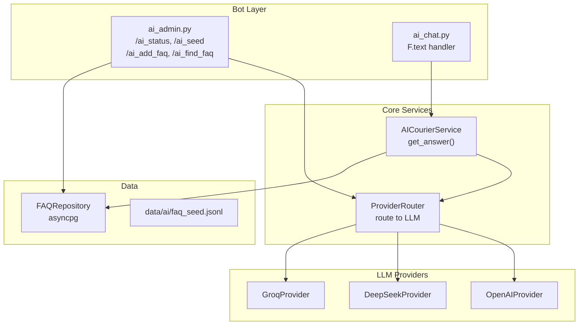

# AI-роутеры, сервисы и DI-интеграция

## Текущее состояние

- Роутеры живут в `src/bot/admin/` и `src/bot/handlers/`, регистрируются в [src/bot/main.py](src/bot/main.py)
- DI отсутствует: сервисы создаются напрямую в хендлерах
- `FAQRepository` уже реализован в [repositories/faq_repo.py](repositories/faq_repo.py) (asyncpg, не SQLAlchemy)
- В `.env.example` уже есть `GROQ_API_KEY`, `DEEPSEEK_API_KEY`, `OPENAI_API_KEY`, `AI_ENABLED`
- `httpx` уже в зависимостях (для HTTP-запросов к LLM API)
- `require_admin` из [src/bot/admin/admin.py](src/bot/admin/admin.py) проверяет только `ADMIN_IDS` из env (более простая проверка, чем `_can_admin` в `menu.py`)

## Архитектура AI-подсистемы




## Шаг 1: Конфигурация AI в Settings

Файл: [src/config.py](src/config.py)

Добавить поля в `Settings`:

```python
ai_enabled: bool = Field(default=False, alias="AI_ENABLED")
groq_api_key: str = Field(default="", alias="GROQ_API_KEY")
deepseek_api_key: str = Field(default="", alias="DEEPSEEK_API_KEY")
openai_api_key: str = Field(default="", alias="OPENAI_API_KEY")
ai_faq_db_dsn: str = Field(default="", alias="AI_FAQ_DB_DSN")
```

`AI_FAQ_DB_DSN` -- DSN для asyncpg-пула (FAQRepository использует отдельный asyncpg.Pool, не SQLAlchemy).
Если не задан, можно строить DSN из `DATABASE_URL`, заменив `postgresql+asyncpg://` на `postgresql://`.

## Шаг 2: LLM-провайдеры и ProviderRouter

Новая директория: `src/core/services/ai/`

- `src/core/services/ai/__init__.py`
- `src/core/services/ai/base.py` -- базовый протокол/ABC для провайдера
- `src/core/services/ai/groq_provider.py` -- GroqProvider (httpx, endpoint `https://api.groq.com/openai/v1/chat/completions`)
- `src/core/services/ai/deepseek_provider.py` -- DeepSeekProvider (httpx, endpoint `https://api.deepseek.com/v1/chat/completions`)
- `src/core/services/ai/openai_provider.py` -- OpenAIProvider (httpx, endpoint `https://api.openai.com/v1/chat/completions`)
- `src/core/services/ai/router.py` -- ProviderRouter

**BaseProvider** (ABC):

```python
class BaseProvider(ABC):
    name: str
    async def complete(self, messages: list[dict], temperature: float = 0.3) -> str: ...
```

Все три провайдера реализуют один и тот же OpenAI-совместимый HTTP-интерфейс с разными endpoint/model defaults.

**ProviderRouter**:

```python
class ProviderRouter:
    def __init__(self, providers: list[BaseProvider]):
        self.providers = {p.name: p for p in providers}
        self._order = [p.name for p in providers]

    async def complete(self, messages, temperature=0.3) -> str:
        # пробует провайдеров по порядку, при ошибке переходит к следующему
```

## Шаг 3: AICourierService

Файл: `src/core/services/ai_service.py`

```python
class AICourierService:
    def __init__(self, faq_repo: FAQRepository, router: ProviderRouter, logger):
        ...

    async def get_answer(self, user_id: int, text: str) -> AIResponse:
        # 1. Поиск в FAQ
        faq_hits = await self.faq_repo.search(text=text, top_k=3)
        # 2. Если FAQ score >= 0.8, вернуть FAQ-ответ
        # 3. Иначе -- вызов LLM через ProviderRouter с FAQ-контекстом в system prompt
```

`AIResponse` -- простой dataclass с полем `text`.

## Шаг 4: AI-админ роутер

Файл: `src/bot/admin/ai_admin.py`

Команды:

- `/ai_status` -- статус БД (faq_repo.count), список провайдеров
- `/ai_seed` -- загрузка `data/ai/faq_seed.jsonl` в БД через faq_repo.upsert
- `/ai_add_faq` -- ручное добавление FAQ: `/ai_add_faq tag1,tag2 | Вопрос | Ответ`
- `/ai_find_faq` -- поиск FAQ: `/ai_find_faq текст`

Все хендлеры используют `require_admin` из [src/bot/admin/admin.py](src/bot/admin/admin.py).
Зависимости (`faq_repo`, `ai_router`) достаются из `message.bot[...]` (Вариант A DI).

Регистрация: добавить `ai_admin_router` в [src/bot/admin/**init**.py](src/bot/admin/__init__.py).

## Шаг 5: AI-чат роутер

Файл: `src/bot/handlers/ai_chat.py`

- Один хендлер на `F.text` -- пропускает команды (`/...`)
- Достает `ai_service` из `message.bot["ai_service"]` (fallback: None -> сообщение об ошибке)
- Вызывает `ai_service.get_answer(user_id, text)`

Регистрация: в [src/bot/main.py](src/bot/main.py) **последним** (после admin и start), чтобы не перехватывать команды.

## Шаг 6: DI (Вариант A) в main.py

Файл: [src/bot/main.py](src/bot/main.py)

В функции `main()` перед `dp.start_polling(bot)`:

```python
settings = get_settings()
if settings.ai_enabled:
    pool = await asyncpg.create_pool(dsn=ai_faq_dsn)
    faq_repo = FAQRepository(pool)
    providers = []
    if settings.groq_api_key:
        providers.append(GroqProvider(settings.groq_api_key))
    if settings.deepseek_api_key:
        providers.append(DeepSeekProvider(settings.deepseek_api_key))
    if settings.openai_api_key:
        providers.append(OpenAIProvider(settings.openai_api_key))
    ai_router = ProviderRouter(providers)
    ai_service = AICourierService(faq_repo=faq_repo, router=ai_router, ...)

    bot["faq_repo"] = faq_repo
    bot["ai_router"] = ai_router
    bot["ai_service"] = ai_service
    bot["db_pool"] = pool
```

Также добавить `on_shutdown` для закрытия asyncpg-пула.

## Шаг 7: Seed-файл и директория data

Создать пустую структуру: `data/ai/faq_seed.jsonl`

Формат строки:

```json
{"id": "faq_001", "q": "Что делать если яйца разбиты?", "a": "1) Сфотографировать 2) ...", "tags": ["damage"]}
```

## Шаг 8: Обновить .env.example

Добавить `AI_FAQ_DB_DSN` (если используем отдельный DSN для asyncpg).

## Создаваемые/изменяемые файлы

**Новые:**

- `src/core/services/ai/__init__.py`
- `src/core/services/ai/base.py`
- `src/core/services/ai/groq_provider.py`
- `src/core/services/ai/deepseek_provider.py`
- `src/core/services/ai/openai_provider.py`
- `src/core/services/ai/router.py`
- `src/core/services/ai_service.py`
- `src/bot/admin/ai_admin.py`
- `src/bot/handlers/ai_chat.py`
- `data/ai/faq_seed.jsonl`

**Изменяемые:**

- [src/config.py](src/config.py) -- добавить AI-поля
- [src/bot/main.py](src/bot/main.py) -- DI + регистрация роутеров + shutdown
- [src/bot/admin/**init**.py](src/bot/admin/__init__.py) -- подключить ai_admin_router
- [.env.example](.env.example) -- добавить AI_FAQ_DB_DSN

