# План: Delivery Assistant MVP (ТЗ v1.4)

## Текущее состояние

- Есть: [.env.example](.env.example) (Postgres async, Redis, S3/MinIO, BOT_TOKEN, ADMIN_IDS и др.), [docs/*](docs/) и [.cursor/rules/](.cursor/rules/)* — **не перетирать**, только дополнять.
- Нет: папок `src/`, `migrations/`, кода бота, БД, очереди, Docker.

---

## ШАГ 0 — Структура и зависимости

**Создать папки (если отсутствуют):**

- `src/bot/`, `src/bot/admin/`
- `src/core/services/`, `src/core/domain/`
- `src/infra/db/`, `src/infra/queue/`, `src/infra/notifications/`, `src/infra/storage/`, `src/infra/integrations/`
- `migrations/`

**Зависимости (Poetry или requirements.txt):**

- **Bot:** aiogram 3.x, pydantic, structlog
- **DB:** SQLAlchemy 2.x (async), asyncpg, Alembic
- **Queue:** celery[redis]
- **Storage:** boto3 (MinIO/S3)
- **Dev:** pytest, pytest-asyncio, black, ruff, mypy

**Конфигурация:**

- `pyproject.toml` — проект, scripts, tool config (black, ruff, mypy)
- `src/config.py` — загрузка из env (pydantic BaseSettings): `DATABASE_URL`, `REDIS_URL`, `S3`_*, `BOT_TOKEN`, `ADMIN_IDS`, `TIMEZONE`, `LOG_LEVEL`
- Корневой `src/__init__.py` и пакеты во всех перечисленных директориях

---

## ШАГ 1 — Docker Compose и ENV

**Файлы:**

- [docker-compose.yml](docker-compose.yml) (создать в корне):
  - `postgres` (image postgres:16-alpine), `redis` (redis:7-alpine), `minio` (minio/minio server /data)
  - **Без** `ports` для postgres и redis (только внутренняя сеть); minio — порты 9000 (API) и 9001 (console) для локальной отладки
  - `bot`, `worker` (celery), опционально `scheduler` — образ из одного Dockerfile (multi-stage или один stage)
- [Dockerfile](Dockerfile) — Python 3.12, установка зависимостей, `CMD` по умолчанию для бота; worker/scheduler через `command:` в compose
- [.env.example](.env.example) — **дополнить** (не перетирать): например `CELERY_BROKER_URL=redis://redis:6379/1`, `MINIO_CONSOLE_PORT=9001` при необходимости
- [Makefile](Makefile): `up` (compose up -d), `migrate` (alembic upgrade head в контейнере или локально), `bot` (run bot), `worker` (run celery worker), `down`, `logs`

**Сеть:** одна общая сеть для postgres, redis, minio, bot, worker.

---

## ШАГ 2 — База данных и Alembic

**Настройка:**

- [alembic.ini](alembic.ini) — стандартная настройка, `sqlalchemy.url` из env
- [migrations/env.py](migrations/env.py) — async run_migrations_online, передача `AsyncEngine`, использование `asyncio.run`
- [src/infra/db/session.py](src/infra/db/session.py) — `create_async_engine`, `async_sessionmaker`, `get_session` (dependency)

**Модели и миграция:**

- [src/infra/db/models.py](src/infra/db/models.py) — все ORM-модели в соответствии со схемой ниже
- [src/infra/db/enums.py](src/infra/db/enums.py) — Enum’ы: UserRole, AssetType, AssetStatus, AssetCondition, LogType, Severity, NotificationType/Status, NotificationChannel, IngestStatus, IngestSource

**Схема миграции 001_initial_mvp:**

| Таблица                            | Ключевые поля и ограничения                                                                                                                                                             |
| ---------------------------------- | --------------------------------------------------------------------------------------------------------------------------------------------------------------------------------------- |
| **territories**                    | id, name, created_at                                                                                                                                                                    |
| **teams**                          | id, territory_id FK, name, created_at                                                                                                                                                   |
| **darkstores**                     | id, team_id FK, code, name, is_white bool, created_at                                                                                                                                   |
| **users**                          | id, tg_user_id UNIQUE, role enum, display_name, created_at, updated_at                                                                                                                  |
| **user_scopes**                    | id, user_id FK, team_id FK nullable, darkstore_id FK nullable, UNIQUE(user_id, team_id, darkstore_id) partial                                                                           |
| **couriers**                       | id, darkstore_id FK, external_key, name, created_at                                                                                                                                     |
| **chat_bindings**                  | id, team_id FK, chat_id, category enum (alerts/daily/assets/incidents/general), topic_id nullable, created_at                                                                           |
| **assets**                         | id, darkstore_id FK, asset_type enum, serial, status enum, condition enum, created_at, updated_at; UNIQUE(darkstore_id, asset_type, serial)                                             |
| **asset_assignments**              | id, asset_id FK, courier_id FK, assigned_at, returned_at nullable; один активный на asset (returned_at IS NULL) — unique partial index                                                  |
| **asset_events**                   | id, asset_id FK, assignment_id FK nullable, event_type, payload jsonb, created_at                                                                                                       |
| **shift_log**                      | id, darkstore_id FK, log_type enum, severity enum, title, details text, created_at, created_by FK nullable; индексы по ds + date                                                        |
| **notifications**                  | id, type enum, status enum, dedupe_key nullable UNIQUE, payload jsonb, created_at                                                                                                       |
| **notification_targets**           | id, notification_id FK, channel enum, chat_id, topic_id nullable, created_at                                                                                                            |
| **notification_delivery_attempts** | id, notification_id FK, attempted_at, status, error_code, retry_after nullable, created_at                                                                                              |
| **ingest_batches**                 | id, source enum, content_hash, status enum, rules_version, created_at; **UNIQUE(source, content_hash)**                                                                                 |
| **delivery_orders_raw**            | id, batch_id FK, order_key, ds_code, zone_code nullable, start_delivery_at, deadline_at, finish_at_raw, durations jsonb, raw jsonb, created_at; индексы по batch_id, ds_code, zone_code |

Во всех таблицах: PK, при необходимости `created_at`/`updated_at`; FK с индексами; индексы для частых фильтров (по darkstore, дате, batch_id, notification status).

**Проверка:** в миграции реализовать `downgrade()` — удаление таблиц в обратном порядке зависимостей.

---

## ШАГ 3 — Репозитории и сервисы

**Session и база:**

- Использовать [src/infra/db/session.py](src/infra/db/session.py) для всех репозиториев.

**Репозитории** ([src/infra/db/repositories/](src/infra/db/repositories/)):

- **AssetsRepository:** `create_asset(darkstore_id, asset_type, serial, condition)`, `get_by_type_serial(darkstore_id, asset_type, serial)`, `create_assignment(asset_id, courier_id)`, `close_assignment(assignment_id)`, проверка единственного активного assignment на asset.
- **ShiftLogRepository:** `create_log(darkstore_id, log_type, severity, title, details, created_by)`, `list_by_darkstore_date(darkstore_id, date_from, date_to)`.
- **NotificationRepository:** `create_notification(type, payload, dedupe_key)`, `create_targets(notification_id, [(channel, chat_id, topic_id)])`, `add_attempt(notification_id, status, error_code, retry_after)`, `update_notification_status(notification_id, status)`.
- **IngestRepository:** `get_batch_by_source_hash(source, content_hash)` (для идемпотентности), `create_batch(source, content_hash, rules_version)`, `insert_raw_rows(batch_id, rows)`.

**Сервисы** ([src/core/services/](src/core/services/)):

- **AssetsService:** `issue_asset(darkstore_id, courier_id, asset_type, serial, condition, photo_file_id?)` — создание/поиск asset, создание assignment, при необходимости event; вызов репозитория.
- **AssetsService:** `return_asset(assignment_id)` — закрытие assignment, event.
- **ShiftLogService:** `create_incident(darkstore_id, category, severity, title, details, attachments?, user_id?)` — создание записи в shift_log.
- **NotificationService:** `enqueue_notification(type, targets[], payload, dedupe_key?)` — создание notification + targets в БД, постановка задачи `deliver_notification(notification_id)` в Celery (не отправка из сервиса напрямую).
- **IngestService:** `accept_csv_upload(file_bytes, filename, source='csv_upload')` — вычисление content_hash, проверка дубликата по IngestRepository.get_batch_by_source_hash; при дубликате — возврат существующего batch_id; иначе — сохранение файла в MinIO (infra/storage), создание batch в БД, постановка задачи парсинга в очередь. Возврат batch_id и статус.

**Domain:** [src/core/domain/](src/core/domain/) — при необходимости простые исключения `DomainError` и типы (enums можно переиспользовать из infra/db/enums для границ).

---

## ШАГ 4 — Очередь и доставка уведомлений

**Celery:**

- [src/infra/queue/celery_app.py](src/infra/queue/celery_app.py) — Celery app, broker=REDIS_URL, result_backend=REDIS_URL, таски из `src.infra.queue.tasks`.
- [src/infra/queue/tasks.py](src/infra/queue/tasks.py) — задача `deliver_notification(notification_id)`:
  - Загрузить notification + targets из БД.
  - Для каждого target: вызвать соответствующий channel (Telegram). При 429 — записать attempt с retry_after, сделать retry с countdown=retry_after. При другой ошибке — attempt + exponential backoff retry.
  - После успешной доставки — обновить status notification, записать успешный attempt.
- Дедуп по `dedupe_key`: при создании notification проверять в БД уникальность (unique constraint или select перед insert).

**Канал Telegram:**

- [src/infra/notifications/telegram_channel.py](src/infra/notifications/telegram_channel.py) — класс `TelegramChannel` с методом `send_message(chat_id, text, topic_id=None)` через Bot API (aiohttp или aiogram Bot). Обработка 429: возвращать структуру с `retry_after` для использования в задаче.

**Плагинная модель:** [src/infra/notifications/channels.py](src/infra/notifications/channels.py) — интерфейс/базовый класс канала; Telegram — реализация. Worker по полю `channel` в target выбирает канал.

---

## ШАГ 5 — Aiogram бот (админ + FSM)

**Точка входа:** [src/bot/main.py](src/bot/main.py) — загрузка config, создание Dispatcher, регистрация routers, polling (или webhook при наличии env).

**Роутеры:**

- [src/bot/handlers/start.py](src/bot/handlers/start.py) — `/start`: приветствие, определение/сохранение user по tg_user_id, вывод role.
- [src/bot/admin/**init**.py](src/bot/admin/__init__.py) — роутер админки; проверка `user.role in (ADMIN, LEAD, CURATOR)` и/или ADMIN_IDS.
- [src/bot/admin/menu.py](src/bot/admin/menu.py) — `/admin`: inline-меню — ТМЦ, Журнал, Импорт CSV, Настройки (заглушка), Мониторинг (заглушка).

**FSM (states в [src/bot/states.py](src/bot/states.py)):**

1. **ТМЦ выдача** (кнопка «Выдать» или команда типа `/tmc_issue`): состояния — выбор ДС (пока текстом), курьер (текстом), тип ТМЦ, serial, condition, фото (опционально), подтверждение. По confirm — вызов `AssetsService.issue_asset(...)`, ответ «записано».
2. **Инцидент** (`/incident` или кнопка): ДС, category, severity, title, details, вложения (опционально), confirm. По confirm — `ShiftLogService.create_incident(...)`.
3. **Импорт CSV:** приём документа (document), вызов `IngestService.accept_csv_upload(...)` (файл скачать через bot.get_file, передать bytes). Ответ «batch создан, ID …» или «дубликат, batch …».

Все долгие операции (парсинг, массовая рассылка) — только через очередь; в handlers только вызов сервисов и постановка задач.

**Middleware:** при необходимости — инъекция сессии БД и текущего user в context.

---

## ШАГ 6 — Документация

Обновить/дополнить существующие файлы (не удалять содержимое, которое уже соответствует ТЗ):

- [docs/ARCHITECTURE.md](docs/ARCHITECTURE.md) — добавить диаграмму модулей (bot → services → repositories / queue), data flow: ingest → parse → raw → calc → snapshots → notifications → delivery attempts; перечислить компоненты infra (db, queue, notifications, storage).
- [docs/DEPLOYMENT.md](docs/DEPLOYMENT.md) — как поднять через `make up` / `docker compose up`, обязательные env vars (из .env.example), порядок: миграции `make migrate`, запуск bot и worker; бэкапы БД и MinIO; обновление и откат (образ + миграции).
- [docs/RUNBOOK.md](docs/RUNBOOK.md) — уже есть разделы 429, bindings, ingest, zone_code, scheduler; при необходимости добавить пункты про «бот не отвечает» (проверить bot/worker), «миграция не применяется» (проверить DATABASE_URL и порядок запуска).
- [docs/ADMIN_GUIDE.md](docs/ADMIN_GUIDE.md) — по ролям уже есть; добавить описание пунктов админ-меню: ТМЦ (выдача/возврат), Журнал (создание инцидента), Импорт CSV (загрузка файла), Настройки/Мониторинг (заглушки).
- [docs/DATA_DICTIONARY.md](docs/DATA_DICTIONARY.md) — дополнить таблицами MVP: territories, teams, darkstores, users, user_scopes, assets, asset_assignments, asset_events, shift_log, notifications/targets/attempts, ingest_batches, delivery_orders_raw (поля raw, zone_code nullable).
- [docs/SECURITY.md](docs/SECURITY.md) — оставить разделы про секреты, сеть, RBAC, аудит; уточнить, что postgres/redis не экспонируются; админ-доступ по ADMIN_IDS и role.

---

## ШАГ 7 — Тесты (минимальные)

- [tests/conftest.py](tests/conftest.py) — pytest-asyncio, фикстуры: async session (тестовая БД или SQLite in-memory async), создание таблиц из моделей или миграции.
- [tests/test_assets_repository.py](tests/test_assets_repository.py) — выдача asset → один активный assignment; попытка выдать второй активный на тот же asset — ожидаемая ошибка/уникальность.
- [tests/test_ingest_repository.py](tests/test_ingest_repository.py) — два вызова create_batch с одинаковыми source+content_hash — второй не создаёт дубликат (идемпотентность).
- [tests/test_notification_delivery.py](tests/test_notification_delivery.py) — при «доставке» с ошибкой (mock Telegram 429) — в БД создаётся запись в notification_delivery_attempts с соответствующим status/error_code/retry_after.

Запуск: `pytest tests/ -v` (с asyncio_mode=auto в pytest.ini или в conftest).

---

## Порядок реализации и ключевые файлы

```mermaid
flowchart LR
  subgraph step0 [Step 0]
    A0[Folders]
    A1[pyproject]
    A2[config]
  end
  subgraph step1 [Step 1]
    B1[compose]
    B2[Makefile]
  end
  subgraph step2 [Step 2]
    C1[models]
    C2[alembic 001]
  end
  subgraph step3 [Step 3]
    D1[repos]
    D2[services]
  end
  subgraph step4 [Step 4]
    E1[Celery]
    E2[deliver_notification]
    E3[TelegramChannel]
  end
  subgraph step5 [Step 5]
    F1[handlers]
    F2[admin FSM]
  end
  step0 --> step1
  step1 --> step2
  step2 --> step3
  step3 --> step4
  step4 --> step5
```

**Список создаваемых/изменяемых файлов (сводка):**

- **Корень:** `docker-compose.yml`, `Dockerfile`, `Makefile`, `pyproject.toml`, `alembic.ini`, `.env.example` (дополнение).
- **Конфиг:** `src/config.py`, `src/__init__.py`.
- **Структура:** все перечисленные папки с `__init__.py`.
- **DB:** `src/infra/db/session.py`, `src/infra/db/models.py`, `src/infra/db/enums.py`, `src/infra/db/repositories/*.py`, `migrations/env.py`, `migrations/versions/001_initial_mvp.py`.
- **Сервисы:** `src/core/services/assets.py`, `shift_log.py`, `notifications.py`, `ingest.py`; `src/core/domain/exceptions.py` при необходимости.
- **Очередь:** `src/infra/queue/celery_app.py`, `src/infra/queue/tasks.py`.
- **Уведомления:** `src/infra/notifications/channels.py`, `src/infra/notifications/telegram_channel.py`.
- **Storage:** `src/infra/storage/s3.py` (MinIO put_object, get_object для ingest).
- **Бот:** `src/bot/main.py`, `src/bot/handlers/start.py`, `src/bot/admin/menu.py`, FSM-хендлеры для ТМЦ/инцидент/CSV в `src/bot/admin/` или `src/bot/handlers/`, `src/bot/states.py`.
- **Документация:** обновление всех шести файлов в `docs/`.
- **Тесты:** `tests/conftest.py`, `tests/test_assets_repository.py`, `tests/test_ingest_repository.py`, `tests/test_notification_delivery.py`, `pytest.ini` или настройка в pyproject.

---

## Команды для запуска и проверки

- **Поднять стек:** `make up` (или `docker compose up -d`)
- **Миграции:** `make migrate` (или `docker compose run --rm bot alembic upgrade head`)
- **Бот:** `make bot` (или `docker compose up bot` / `python -m src.bot.main`)
- **Воркер:** `make worker`
- **Проверка бота:** отправить `/start` и `/admin` в Telegram; проверить логи контейнеров `docker compose logs -f bot`

После подтверждения плана можно переходить к реализации по шагам.