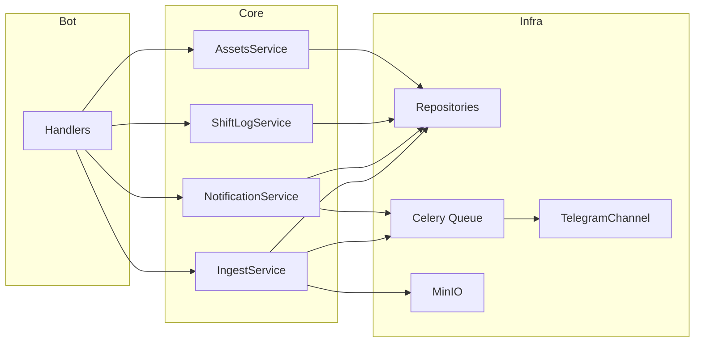

# План: Delivery Assistant MVP (ТЗ v1.4)

## Текущее состояние

- **Есть:** [.env.example](.env.example) (Postgres async, Redis, S3/MinIO, BOT_TOKEN, ADMIN_IDS), [docs/*](docs/) и [.cursor/rules/](.cursor/rules/) — не перетирать, только дополнять.
- **Нет:** папок `src/`, `migrations/`, кода бота, БД, очереди, Docker.

---

## ШАГ 0 — Структура и зависимости

**Создать папки:**

- `src/bot/`, `src/bot/admin/`, `src/bot/handlers/`
- `src/core/services/`, `src/core/domain/`
- `src/infra/db/`, `src/infra/db/repositories/`, `src/infra/queue/`, `src/infra/notifications/`, `src/infra/storage/`, `src/infra/integrations/`
- `migrations/`, `migrations/versions/`
- `tests/`

**Зависимости (pyproject.toml):**

- Bot: aiogram >=3.0, pydantic-settings, structlog
- DB: SQLAlchemy >=2.0, asyncpg, alembic
- Queue: celery[redis]
- Storage: boto3
- Dev: pytest, pytest-asyncio, black, ruff

**Конфигурация:**

- [src/config.py](src/config.py) — pydantic BaseSettings из env: `DATABASE_URL`, `REDIS_URL`, `CELERY_BROKER_URL`, S3_*, `BOT_TOKEN`, `ADMIN_IDS`, `TIMEZONE`, `LOG_LEVEL`
- Корневой [src/__init__.py](src/__init__.py) и `__init__.py` во всех пакетах

---

## ШАГ 1 — Docker Compose и ENV

**Файлы:**

- **docker-compose.yml** (корень): сервисы `postgres` (postgres:16-alpine), `redis` (redis:7-alpine), `minio` (minio/minio server /data), `bot`, `worker` (celery), опционально `scheduler`. Postgres и Redis **без** `ports` (только внутренняя сеть). Minio — 9000, 9001 для локальной отладки.
- **Dockerfile**: Python 3.12, установка зависимостей, CMD по умолчанию для бота; worker/scheduler через `command:` в compose.
- **.env.example** — **дополнить** (не перетирать): `CELERY_BROKER_URL=redis://redis:6379/1`, при необходимости переменные для MinIO.
- **Makefile**: `up` (compose up -d), `migrate` (alembic upgrade head), `bot`, `worker`, `down`, `logs`.

---

## ШАГ 2 — База данных и Alembic

**Настройка:**

- **alembic.ini** — `sqlalchemy.url` из env (или через env.py).
- **migrations/env.py** — async run_migrations_online, AsyncEngine, asyncio.run.
- [src/infra/db/session.py](src/infra/db/session.py) — create_async_engine, async_sessionmaker, get_session.

**Enums** ([src/infra/db/enums.py](src/infra/db/enums.py)): UserRole, AssetType, AssetStatus, AssetCondition, LogType, Severity, NotificationType/Status, NotificationChannel, IngestStatus, IngestSource.

**Модели** ([src/infra/db/models.py](src/infra/db/models.py)) — ORM под схему ниже.

**Миграция 001_initial_mvp** — схема:

| Таблица | Ключевые поля и ограничения |
|---------|-----------------------------|
| territories | id, name, created_at |
| teams | id, territory_id FK, name, created_at |
| darkstores | id, team_id FK, code, name, is_white bool, created_at |
| users | id, tg_user_id UNIQUE, role enum, display_name, created_at, updated_at |
| user_scopes | id, user_id FK, team_id FK nullable, darkstore_id FK nullable, partial UNIQUE(user_id, team_id, darkstore_id) |
| couriers | id, darkstore_id FK, external_key, name, created_at |
| chat_bindings | id, team_id FK, chat_id, category enum (alerts/daily/assets/incidents/general), topic_id nullable, created_at |
| assets | id, darkstore_id FK, asset_type, serial, status, condition, created_at, updated_at; UNIQUE(darkstore_id, asset_type, serial) |
| asset_assignments | id, asset_id FK, courier_id FK, assigned_at, returned_at nullable; один активный на asset (partial unique: returned_at IS NULL) |
| asset_events | id, asset_id FK, assignment_id FK nullable, event_type, payload jsonb, created_at |
| shift_log | id, darkstore_id FK, log_type, severity, title, details, created_at, created_by FK nullable; индексы по ds + date |
| notifications | id, type enum, status enum, dedupe_key nullable UNIQUE, payload jsonb, created_at |
| notification_targets | id, notification_id FK, channel enum, chat_id, topic_id nullable, created_at |
| notification_delivery_attempts | id, notification_id FK, attempted_at, status, error_code, retry_after nullable, created_at |
| ingest_batches | id, source enum, content_hash, status enum, rules_version, created_at; **UNIQUE(source, content_hash)** |
| delivery_orders_raw | id, batch_id FK, order_key, ds_code, zone_code nullable, start_delivery_at, deadline_at, finish_at_raw, durations jsonb, raw jsonb, created_at; индексы batch_id, ds_code, zone_code |

Во всех таблицах: PK, created_at/updated_at где нужно; FK с индексами; индексы для частых фильтров. **downgrade**: удаление таблиц в обратном порядке зависимостей.

---

## ШАГ 3 — Репозитории и сервисы

**Репозитории** ([src/infra/db/repositories/](src/infra/db/repositories/)):

- **AssetsRepository**: create_asset, get_by_type_serial, create_assignment, close_assignment; проверка единственного активного assignment на asset.
- **ShiftLogRepository**: create_log, list_by_darkstore_date.
- **NotificationRepository**: create_notification, create_targets, add_attempt, update_notification_status.
- **IngestRepository**: get_batch_by_source_hash, create_batch, insert_raw_rows.

**Сервисы** ([src/core/services/](src/core/services/)):

- **AssetsService**: issue_asset (создание/поиск asset, assignment, event при необходимости), return_asset (закрытие assignment, event).
- **ShiftLogService**: create_incident (запись в shift_log).
- **NotificationService**: enqueue_notification — создание notification + targets в БД, постановка задачи `deliver_notification(notification_id)` в Celery (без прямой отправки).
- **IngestService**: accept_csv_upload — content_hash, проверка дубликата; при новом — сохранение в MinIO ([src/infra/storage/s3.py](src/infra/storage/s3.py)), создание batch, постановка задачи парсинга в очередь. Возврат batch_id и статус.

**Domain:** [src/core/domain/exceptions.py](src/core/domain/exceptions.py) — DomainError при необходимости.

---

## ШАГ 4 — Очередь и доставка уведомлений

- **Celery**: [src/infra/queue/celery_app.py](src/infra/queue/celery_app.py) — broker/backend из REDIS_URL; таски в [src/infra/queue/tasks.py](src/infra/queue/tasks.py).
- **Таск deliver_notification(notification_id)**: загрузка notification + targets из БД; для каждого target вызов канала (Telegram). При 429 — запись attempt с retry_after, retry с countdown=retry_after; при другой ошибке — attempt + exponential backoff retry. После успеха — обновление status, запись успешного attempt.
- **Дедуп**: по dedupe_key на уровне БД (UNIQUE) и/или проверка в сервисе перед созданием.
- **TelegramChannel**: [src/infra/notifications/telegram_channel.py](src/infra/notifications/telegram_channel.py) — send_message(chat_id, text, topic_id=None), при 429 возвращать retry_after для использования в таске.
- **Интерфейс каналов**: [src/infra/notifications/channels.py](src/infra/notifications/channels.py) — базовый класс/протокол; worker по полю channel в target выбирает канал.

---

## ШАГ 5 — Aiogram бот (админ + FSM)

- **Точка входа**: [src/bot/main.py](src/bot/main.py) — config, Dispatcher, регистрация routers, polling.
- **Роутеры**: [src/bot/handlers/start.py](src/bot/handlers/start.py) — /start (приветствие, user по tg_user_id, role); [src/bot/admin/menu.py](src/bot/admin/menu.py) — /admin с проверкой role/ADMIN_IDS, inline-меню: ТМЦ, Журнал, Импорт CSV, Настройки (заглушка), Мониторинг (заглушка).
- **FSM** ([src/bot/states.py](src/bot/states.py)):
  1. **ТМЦ выдача**: выбор ДС (текстом), курьер, тип, serial, condition, фото (опц.), confirm → AssetsService.issue_asset → ответ «записано».
  2. **Инцидент**: ДС, category, severity, title, details, вложения (опц.), confirm → ShiftLogService.create_incident → shift_log.
  3. **Импорт CSV**: приём document → скачать файл → IngestService.accept_csv_upload → ответ «batch создан, ID …» или «дубликат, batch …».

Все долгие операции только через очередь; в handlers только вызов сервисов и постановка задач. Middleware при необходимости — сессия БД и текущий user в context.

---

## ШАГ 6 — Документация (обновить/дополнить)

- [docs/ARCHITECTURE.md](docs/ARCHITECTURE.md) — диаграмма модулей (bot → services → repositories / queue), data flow: ingest → parse → raw → calc → snapshots → notifications → delivery attempts; компоненты infra.
- [docs/DEPLOYMENT.md](docs/DEPLOYMENT.md) — поднятие через make up / docker compose, env vars из .env.example, миграции make migrate, запуск bot/worker, бэкапы, обновление/откат.
- [docs/RUNBOOK.md](docs/RUNBOOK.md) — сохранить 429, bindings, ingest, zone_code, scheduler; при необходимости добавить «бот не отвечает», «миграция не применяется».
- [docs/ADMIN_GUIDE.md](docs/ADMIN_GUIDE.md) — описание пунктов меню: ТМЦ (выдача/возврат), Журнал (инцидент), Импорт CSV, Настройки/Мониторинг (заглушки).
- [docs/DATA_DICTIONARY.md](docs/DATA_DICTIONARY.md) — таблицы MVP: territories, teams, darkstores, users, user_scopes, assets, asset_assignments, asset_events, shift_log, notifications/targets/attempts, ingest_batches, delivery_orders_raw (raw, zone_code nullable).
- [docs/SECURITY.md](docs/SECURITY.md) — секреты, сеть (postgres/redis не наружу), RBAC, админ по ADMIN_IDS и role.

---

## ШАГ 7 — Тесты (минимальные)

- [tests/conftest.py](tests/conftest.py) — pytest-asyncio, фикстуры: async session (тестовая БД или SQLite in-memory), создание таблиц из моделей или миграция.
- [tests/test_assets_repository.py](tests/test_assets_repository.py) — issue asset → один активный assignment; второй активный на тот же asset — ошибка/уникальность.
- [tests/test_ingest_repository.py](tests/test_ingest_repository.py) — два create_batch с одинаковыми source+content_hash — идемпотентность (второй не дубликат или возврат существующего).
- [tests/test_notification_delivery.py](tests/test_notification_delivery.py) — при доставке с ошибкой (mock 429) — запись в notification_delivery_attempts с status/error_code/retry_after.

Запуск: `pytest tests/ -v` (asyncio_mode=auto в pytest.ini или pyproject).

---

## Диаграмма потока данных

---

## Список создаваемых/изменяемых файлов

**Корень:** docker-compose.yml, Dockerfile, Makefile, pyproject.toml, alembic.ini, .env.example (дополнение).

**Конфиг и структура:** src/config.py, src/__init__.py, все пакеты с __init__.py.

**DB:** src/infra/db/session.py, models.py, enums.py, repositories/assets.py, shift_log.py, notifications.py, ingest.py; migrations/env.py, migrations/script.py.mako, migrations/versions/001_initial_mvp.py.

**Сервисы:** src/core/services/assets.py, shift_log.py, notifications.py, ingest.py; src/core/domain/exceptions.py.

**Очередь и уведомления:** src/infra/queue/celery_app.py, tasks.py; src/infra/notifications/channels.py, telegram_channel.py; src/infra/storage/s3.py.

**Бот:** src/bot/main.py, src/bot/states.py, src/bot/handlers/start.py, src/bot/admin/__init__.py, menu.py, FSM-хендлеры для ТМЦ/инцидент/CSV.

**Документация:** обновление docs/ARCHITECTURE.md, DEPLOYMENT.md, RUNBOOK.md, ADMIN_GUIDE.md, DATA_DICTIONARY.md, SECURITY.md.

**Тесты:** tests/conftest.py, test_assets_repository.py, test_ingest_repository.py, test_notification_delivery.py, pytest.ini или настройка в pyproject.toml.

---

## Команды для запуска и проверки

- **Поднять стек:** `make up` или `docker compose up -d`
- **Миграции:** `make migrate` или `docker compose run --rm bot alembic upgrade head`
- **Бот:** `make bot` или `docker compose up bot`
- **Воркер:** `make worker`
- **Проверка:** отправить в Telegram `/start` и `/admin`; логи: `docker compose logs -f bot`
- **Тесты:** `pytest tests/ -v`
