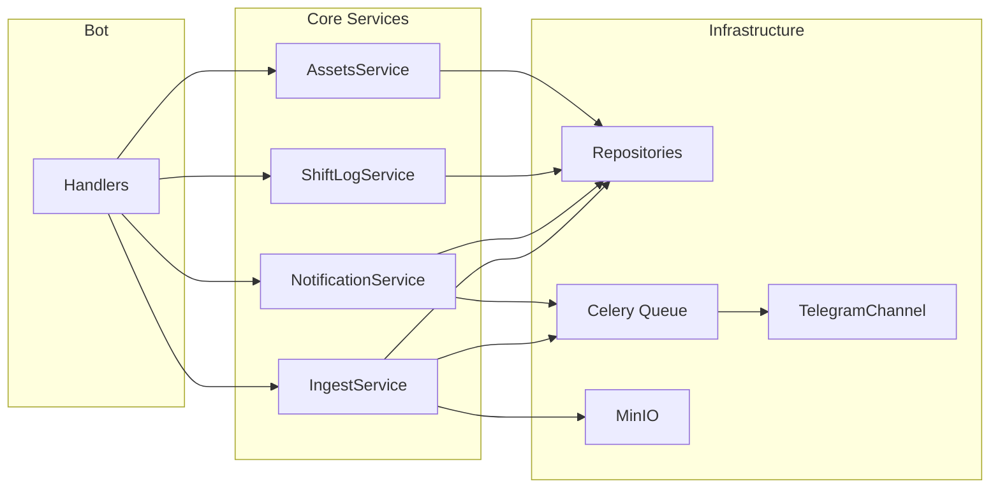

# Архитектура

## Цели
- Telegram — только канал уведомлений и UI
- Бизнес-логика в сервисах, тестируемая отдельно
- Идемпотентный ingest и надёжная доставка уведомлений

## Схема модулей и поток данных

- **Handlers** (aiogram): только валидация ввода, вызов сервисов, ответ пользователю. Долгие операции и рассылки — только через очередь.
- **Core Services**: бизнес-сценарии (выдача ТМЦ, инцидент, уведомление, ingest). Работают с репозиториями и ставят задачи в Celery.
- **Repositories**: доступ к БД (PostgreSQL, async SQLAlchemy 2).
- **Celery**: задачи `deliver_notification`, `parse_ingest_batch` и др. Доставка уведомлений через TelegramChannel с учётом 429 и retry.
- **MinIO/S3**: хранение загруженных CSV и артефактов.

## Компоненты верхнего уровня
- **src/bot**: Telegram-адаптер (aiogram 3), handlers, admin menu, FSM (ТМЦ, журнал, импорт CSV).
- **src/core/services**: AssetsService, ShiftLogService, NotificationService, IngestService.
- **src/infra/db**: сессия, модели, репозитории (assets, shift_log, notifications, ingest, darkstores, users).
- **src/infra/queue**: Celery app, задачи доставки и парсинга.
- **src/infra/notifications**: каналы (TelegramChannel), интерфейс DeliveryResult (success, retry_after, error_code).
- **src/infra/storage**: S3/MinIO клиент для ingest-файлов.
- **src/infra/integrations**: зарезервировано (Superset API/DB, парсеры).

## Поток данных: ingest → calc → snapshots → alerts
1) Строки CSV/API/DB → `ingest_batches` (UNIQUE source + content_hash).
2) Парсинг (очередь) → `delivery_orders_raw` (zone_code nullable).
3) Расчёт → `delivery_orders_calc` (в следующих итерациях).
4) Агрегация → `metrics_snapshot`.
5) Алерты → `notifications` → `notification_targets` → worker → `notification_delivery_attempts` (Telegram и др.).

## Уведомления
- `NotificationService.enqueue_notification()` создаёт записи в БД и ставит задачу в Celery. Из handlers рассылки не отправляются.
- Worker выполняет `deliver_notification(notification_id)`: загрузка из БД, вызов TelegramChannel, при 429 — запись attempt и retry с countdown.
- Дедуп по `dedupe_key` (UNIQUE в БД).

## Планировщик
- Scheduler (опционально) запускает задачи в очереди; один экземпляр или распределённая блокировка.

## AI (куратор)

### Regulation-first RAG
Ответы строятся по принципу «сначала регламент»: правила, FAQ и кейсы доминируют над свободной генерацией. **Ответ не идёт сразу в LLM**: выполняется каскад решений (access check → must_match → rules → intent → FAQ/RAG → ML classifier → LLM → fallback). Подробно: [AI_CURATOR.md](AI_CURATOR.md#2-каскад-решений-обязательный-порядок).

**Порядок маршрутизации:**
1. **must_match** — жёсткие операционные кейсы из core_policy (повреждение, недозвон, недовоз, опоздание, АКБ).
2. **case_engine** — типовые интенты (damaged_goods, contact_customer, missing_items, late_delivery, battery_fire, payment_terminal и др.) с фиксированными шагами.
3. **FAQ** — keyword → semantic → hybrid; при сильном совпадении ответ из базы.
4. **ML case memory (semantic_case)** — семантическое совпадение по ml_cases.jsonl (кэш эмбеддингов в ml_cases_embeddings.json).
5. **llm_reason** — только форматирование/пояснение по переданному контексту; при отсутствии доказательств — один уточняющий вопрос.
6. **fallback** — только если нет ни must_match, ни case_engine, ни сильного FAQ, ни сильного ML case и LLM недоступен или не дал ответа.

### RAG-формат ответа
Итоговый текст собирается единообразно:
- **Ситуация:** краткое описание (или **Критично:** для опасных кейсов).
- **Что делать сейчас:** нумерованные шаги (1) … 2) …).
- **Когда писать куратору:** когда эскалировать.

Для опасных кейсов (АКБ, пожар и т.п.) используется срочный формат: «Критично / Действия / Немедленно сообщи куратору».

### Канонический стек и данные
- **Код:** `src/core/services/ai/` — AICourierService, ProviderRouter, providers (Groq, DeepSeek, OpenAI), CaseEngine, IntentEngine, EmbeddingsService, CaseClassifier.
- **Репозиторий FAQ (v2):** единственный источник — `src/infra/db/repositories/faq_repo.py`; таблица `faq_ai`.
- **Политика и промпты:** `data/ai/` (core_policy.json, intent_tags.json, prompts/).
- **ML case memory:** `data/ai/ml_cases.jsonl` (id, input, label, decision, explanation); опционально `ml_cases_embeddings.json` для семантического поиска (скрипт `scripts/rebuild_case_embeddings.py`).
- **Единственная точка входа в AI:** `AIFacade` (`src/core/services/ai/ai_facade.py`). Три режима (не один «умный ответчик»): **Courier assistant** (`answer_user`, `proactive_hint`), **Admin copilot** (`answer_admin`), **Analytics assistant** (`analyze_csv`). Подробно: [AI_MODES.md](AI_MODES.md). Handlers, admin и API не вызывают ProviderRouter, AICourierService, RAGService, AnalyticsAssistant напрямую.
- Точки использования фасада: бот (middleware внедряет `ai_facade`), handlers (ai_chat), admin (ai_admin), API (automation), скрипты при необходимости через `build_ai_facade()`; служебные скрипты `scripts/rebuild_faq_embeddings.py`, `scripts/rebuild_case_embeddings.py` не дергают LLM.

**Гибридный retrieval FAQ (keyword → semantic → hybrid):** см. [AI_FAQ_SEARCH.md](AI_FAQ_SEARCH.md). Эмбеддинги: `embedding_vector` (vector(1536), pgvector); пересборка — `scripts/rebuild_faq_embeddings.py`.

**Canonical paths (reference):**
- Код: `src/core/services/ai/ai_courier_service.py`, `provider_router.py`, `providers/*`, `case_engine.py`, `intent_engine.py`, `case_classifier.py`, `embeddings_service.py`, `embedding_service.py`
- FAQ: `src/infra/db/repositories/faq_repo.py`
- Данные: `data/ai/` (core_policy.json, intent_tags.json, prompts/, golden_cases.jsonl, ml_cases.jsonl)

## RBAC
- Роли: ADMIN, LEAD, CURATOR, VIEWER, COURIER.
- Доступ к /admin: роль из (ADMIN, LEAD, CURATOR) или ID в ADMIN_IDS.
- Область видимости: user_scopes (team_id, darkstore_id).
