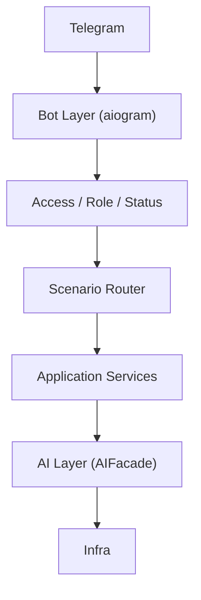

# Архитектура бота: канонические слои

Верхнеуровневая схема (запрос пользователя идёт сверху вниз, ответ — снизу вверх):

## Слои

| Слой | Назначение | Код / модули |
|------|------------|---------------|
| **Telegram** | Канал доставки сообщений | — |
| **Bot Layer** | Dispatcher, роутеры, middlewares; приём/отправка, инъекция зависимостей | `src/bot/main.py`, `src/bot/handlers/`, `src/bot/admin/`, `src/bot/middlewares/` |
| **Access / Role / Status** | Проверки прав и статуса пользователя; что показать на /start; какое меню; доступ к AI и админке; кому слать verification alerts | `src/core/services/access_service.py`, `src/bot/access_guards.py`, `src/bot/menu_renderer.py`, AdminOnlyMiddleware. См. [ACCESS_ROLE_STATUS_LAYER.md](ACCESS_ROLE_STATUS_LAYER.md). |
| **Scenario Router** | Ветвление по типу флоу (Admin, Verification, Courier UI, Curator UI, AI Curator, AI Analyst) | `src/bot/scenario_router.py`, `src/bot/navigation.py`, `src/bot/menu_renderer.py`, `src/bot/states*.py` |
| **Application Services** | Доменная логика; не знают о Telegram | `src/core/services/` (UserService, AccessService, VerificationService, IngestService, NotificationService, risk/proactive, AI-сервисы за фасадом) |
| **AI Layer** | Единственная точка входа — AIFacade; внутри: decision → knowledge → retrieval → policy → generation → validation → explainability | `src/core/services/ai/ai_facade.py`, `ai_courier_service.py`, RAG, провайдеры |
| **Infra** | БД, очереди, хранилище, уведомления, n8n | `src/infra/`, `src/api/automation.py` |

Подробнее: пайплайн AI — [ARCHITECTURE_AI_LAYER.md](ARCHITECTURE_AI_LAYER.md); события и риск — [PROACTIVE_RISK_EVENTS.md](PROACTIVE_RISK_EVENTS.md).

---

## Шпаргалка для разработчиков

### Куда класть новую логику

- **Новый сценарий в боте** — новый роутер или состояния в `src/bot/`, переходы и флоу описать в `scenario_router.py` (BotFlow + маппинг callback_data).
- **Проверка прав** — только через `AccessService` и guard'ы из `src/bot/access_guards.py`; не дублировать проверки в хендлерах.
- **Доменная логика** — в Application Services (`src/core/services/`), не в хендлерах. Хендлер вызывает сервис и отправляет ответ.
- **Новый AI-режим или пайплайн** — расширять за `AIFacade`; снаружи (handlers, API) вызывать только фасад.
- **Новые события (проактивность, риск)** — тип в `AutomationEvent`, контракт payload в [PROACTIVE_RISK_EVENTS.md](PROACTIVE_RISK_EVENTS.md); подписчики в `proactive_layer` или через `event_bus.subscribe`.

### Как подключить новый сценарий

1. Добавить флоу в `BotFlow` и маппинг в `scenario_router.CALLBACK_TO_FLOW` при необходимости.
2. Роутер зарегистрировать в `main.py` (order важен).
3. Меню/кнопки — в `keyboards/`, навигация — через `navigation.py` / `menu_renderer.py`.
4. Проверки доступа — через `require_admin_for_*` или AccessService.

### Как подключить новый AI-режим

1. Добавить метод на `AIFacade` (или расширить существующий режим в `AICourierService`).
2. Handlers и API вызывают только `ai_facade.*`, не провайдеры и не RAG/Intent напрямую.
3. Пайплайн и метки explainability — в [ARCHITECTURE_AI_LAYER.md](ARCHITECTURE_AI_LAYER.md).
