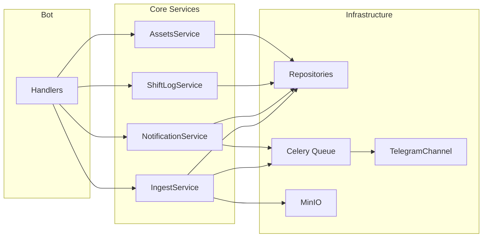

# Архитектура

## Цели
- Telegram — только канал уведомлений и UI
- Бизнес-логика в сервисах, тестируемая отдельно
- Идемпотентный ingest и надёжная доставка уведомлений

## Схема модулей и поток данных

- **Handlers** (aiogram): только валидация ввода, вызов сервисов, ответ пользователю. Долгие операции и рассылки — только через очередь.
- **Core Services**: бизнес-сценарии (выдача ТМЦ, инцидент, уведомление, ingest). Работают с репозиториями и ставят задачи в Celery.
- **Repositories**: доступ к БД (PostgreSQL, async SQLAlchemy 2).
- **Celery**: задачи `deliver_notification`, `parse_ingest_batch` и др. Доставка уведомлений через TelegramChannel с учётом 429 и retry.
- **MinIO/S3**: хранение загруженных CSV и артефактов.

## Компоненты верхнего уровня
- **src/bot**: Telegram-адаптер (aiogram 3), handlers, admin menu, FSM (ТМЦ, журнал, импорт CSV).
- **src/core/services**: AssetsService, ShiftLogService, NotificationService, IngestService.
- **src/infra/db**: сессия, модели, репозитории (assets, shift_log, notifications, ingest, darkstores, users).
- **src/infra/queue**: Celery app, задачи доставки и парсинга.
- **src/infra/notifications**: каналы (TelegramChannel), интерфейс DeliveryResult (success, retry_after, error_code).
- **src/infra/storage**: S3/MinIO клиент для ingest-файлов.
- **src/infra/integrations**: зарезервировано (Superset API/DB, парсеры).

## Поток данных: ingest → calc → snapshots → alerts
1) Строки CSV/API/DB → `ingest_batches` (UNIQUE source + content_hash).
2) Парсинг (очередь) → `delivery_orders_raw` (zone_code nullable).
3) Расчёт → `delivery_orders_calc` (в следующих итерациях).
4) Агрегация → `metrics_snapshot`.
5) Алерты → `notifications` → `notification_targets` → worker → `notification_delivery_attempts` (Telegram и др.).

## Уведомления
- `NotificationService.enqueue_notification()` создаёт записи в БД и ставит задачу в Celery. Из handlers рассылки не отправляются.
- Worker выполняет `deliver_notification(notification_id)`: загрузка из БД, вызов TelegramChannel, при 429 — запись attempt и retry с countdown.
- Дедуп по `dedupe_key` (UNIQUE в БД).

## Планировщик
- Scheduler (опционально) запускает задачи в очереди; один экземпляр или распределённая блокировка.

## AI (куратор)
- **Канонический стек:** `src/core/services/ai/` — AICourierService, ProviderRouter, providers (Groq, DeepSeek, OpenAI), CaseEngine, IntentEngine, EmbeddingsService.
- **Репозиторий FAQ (v2):** единственный источник — `src/infra/db/repositories/faq_repo.py`; таблица `faq_ai`.
- **Политика и промпты:** `data/ai/` (core_policy.json, intent_tags.json, prompts/).
- Точки входа: бот (middleware внедряет ai_service), handlers (ai_chat), admin (ai_admin), скрипты `scripts/smoke_ai.py`, `scripts/smoke_provider_router.py`, `scripts/rebuild_faq_embeddings.py` — все используют core.
- Legacy-модули удалены (src/services/ai, src/core/services/ai_service.py, плоские base/router/провайдеры в core/services/ai, src/ai_policy); импорты только из core и faq_repo.

**Canonical paths (reference):**
- Код: `src/core/services/ai/ai_courier_service.py`, `provider_router.py`, `providers/*`, `case_engine.py`, `intent_engine.py`, `embeddings_service.py`
- FAQ: `src/infra/db/repositories/faq_repo.py`
- Данные: `data/ai/` (core_policy.json, intent_tags.json, prompts/, golden_cases.jsonl)

## RBAC
- Роли: ADMIN, LEAD, CURATOR, VIEWER, COURIER.
- Доступ к /admin: роль из (ADMIN, LEAD, CURATOR) или ID в ADMIN_IDS.
- Область видимости: user_scopes (team_id, darkstore_id).
